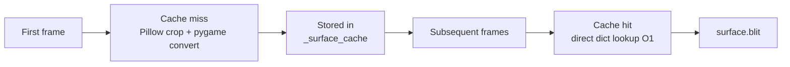

# Renderer

`tiledpy.renderer` is a module-level rendering system for Pygame.
It maintains two global caches that persist across frames and map reloads:

| Cache | Key | Value |
|-------|-----|-------|
| `_surface_cache` | `(firstgid, local_id, flip_h, flip_v, flip_d)` | `pygame.Surface` |
| `_scaled_cache` | `(id(surf), width, height)` | `pygame.Surface` (scaled) |

You generally don't import this module directly — `TiledMap.draw_layer()`
calls it internally.

---

## draw_layer

::: tiledpy.renderer.draw_layer

---

## get_cached_surface

::: tiledpy.renderer.get_cached_surface

---

## clear_surface_cache

::: tiledpy.renderer.clear_surface_cache

---

## cache_stats

::: tiledpy.renderer.cache_stats

---

## Performance tips

- Keep `scale` constant across frames — changing it invalidates `_scaled_cache`
- Use `layer.visible = False` instead of conditional `draw_layer()` calls; the
  culling loop still runs but nothing is blitted
- For very large maps, the number of cache entries equals the number of
  **unique** `(tileset, local_id, flip flags)` combinations used — not the
  total tile count
