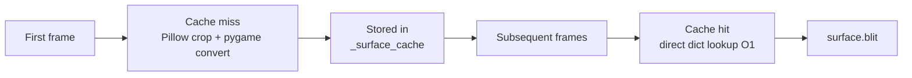

# Renderer

`tiledpy.renderer` is a module-level rendering system for Pygame.
It maintains two global caches that persist across frames and map reloads:

| Cache | Key | Value |
|-------|-----|-------|
| `_surface_cache` | `(firstgid, local_id, flip_h, flip_v, flip_d)` | `pygame.Surface` |
| `_scaled_cache` | `(id(surf), width, height)` | `pygame.Surface` (scaled) |

You generally don't import this module directly — `TiledMap.draw_layer()`
calls it internally.

---

## `draw_layer`

```python
from tiledpy.renderer import draw_layer

draw_layer(
    surface: pygame.Surface,
    layer: TileLayer,
    tilesets: list[Tileset],
    tile_width: int,
    tile_height: int,
    offset: tuple[int, int] = (0, 0),
    scale: int = 1,
) -> None
```

Iterates `layer.iter_tiles()`, applies viewport culling, fetches cached
surfaces, and blits each tile to `surface`.

| Parameter | Description |
|-----------|-------------|
| `surface` | Pygame render target |
| `layer` | `TileLayer` to draw |
| `tilesets` | All tilesets of the map (sorted by `firstgid`) |
| `tile_width` | Base tile width from the map |
| `tile_height` | Base tile height from the map |
| `offset` | Camera `(ox, oy)` in pixels |
| `scale` | Integer scale factor — `1` for no scaling |

**Culling rule:** a tile is skipped when its pixel rect falls entirely outside
`(0, 0, surface.get_width(), surface.get_height())`.

**Opacity:** if `layer.opacity < 1.0`, a per-blit `set_alpha()` is applied
(allocates a surface copy — best to keep opacity at `1.0` for hot layers).

---

## `get_cached_surface`

```python
from tiledpy.renderer import get_cached_surface

surf = get_cached_surface(raw_gid: int, tilesets: list[Tileset]) -> pygame.Surface | None
```

Low-level function. Decodes a raw GID, finds its tileset, and returns (or
creates and caches) the `pygame.Surface`.

Returns `None` for GID 0 (empty tile) or unknown GIDs.

---

## `clear_surface_cache`

```python
from tiledpy.renderer import clear_surface_cache

clear_surface_cache() -> None
```

Clears both `_surface_cache` and `_scaled_cache`.

Call this when:
- You load a completely different map
- You change the `scale` factor at runtime
- You want to free GPU/CPU memory

!!! warning
    After clearing, the next `draw_layer()` call will rebuild the caches from
    scratch. For large maps this may cause a brief stutter.

---

## `cache_stats`

```python
from tiledpy.renderer import cache_stats

stats = cache_stats()
# {"tile_surfaces": 47, "scaled_surfaces": 0}
```

Returns a dict with the current number of entries in each cache.
Useful for debugging memory usage or verifying cache hits.

```python
# Print cache stats every 300 frames
if frame % 300 == 0:
    print(cache_stats())
```

---

## Performance tips



- Keep `scale` constant across frames — changing it invalidates `_scaled_cache`
- Use `layer.visible = False` instead of conditional `draw_layer()` calls; the
  culling loop still runs but nothing is blitted
- For very large maps, the number of cache entries equals the number of
  **unique** `(tileset, local_id, flip flags)` combinations used — not the
  total tile count
