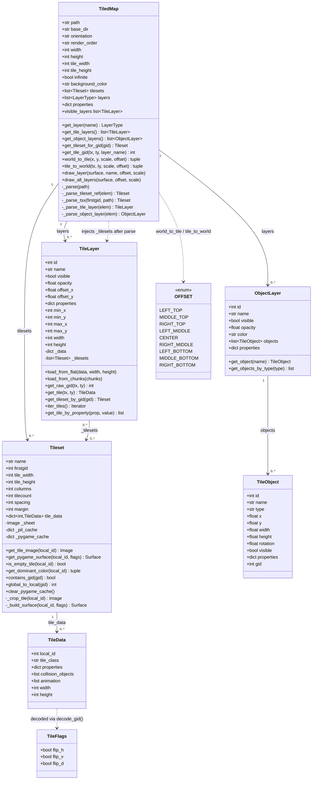
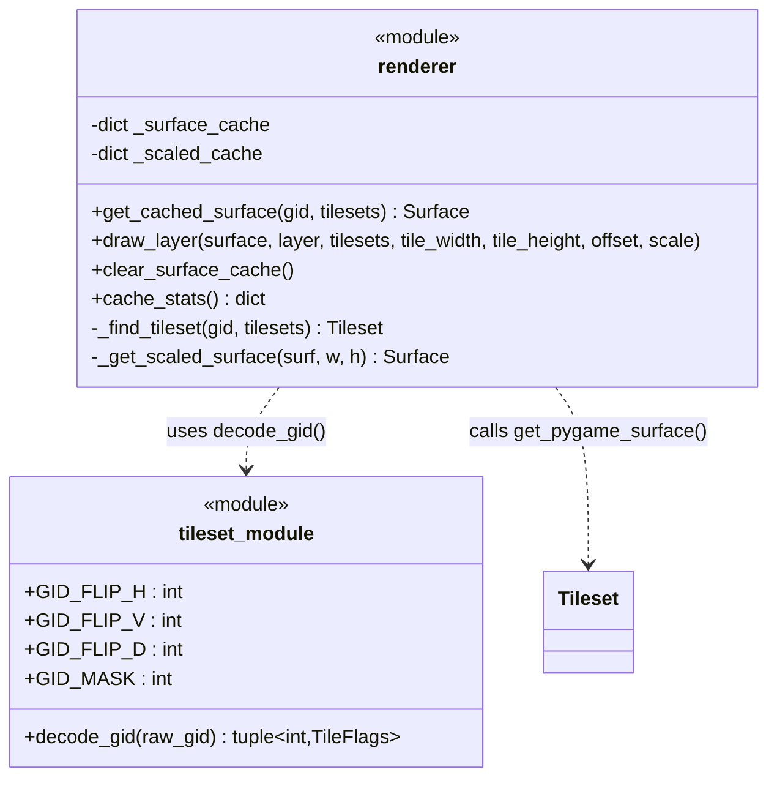
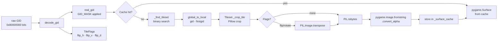
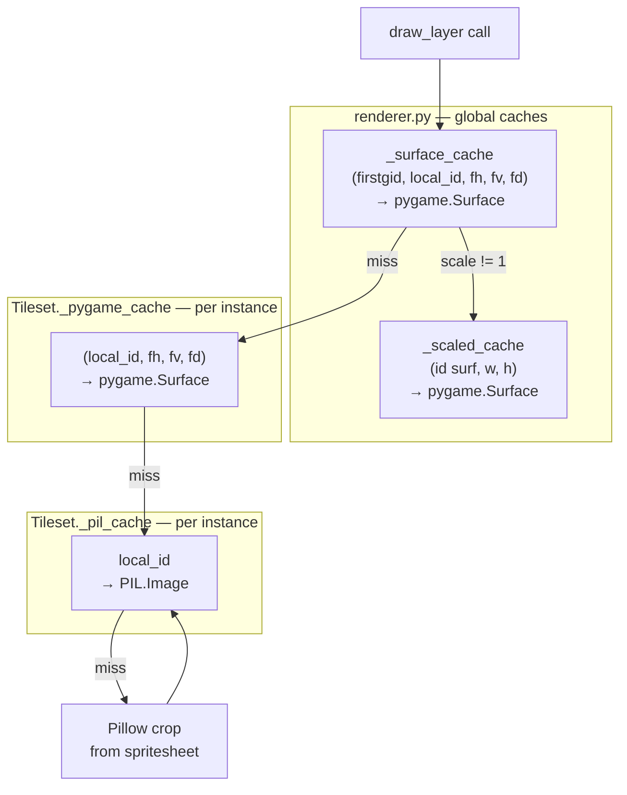

# Architecture

## Class diagram

```mermaid
classDiagram
    class TiledMap {
        +str path
        +str base_dir
        +str orientation
        +str render_order
        +int width
        +int height
        +int tile_width
        +int tile_height
        +bool infinite
        +str background_color
        +list~Tileset~ tilesets
        +list~LayerType~ layers
        +dict properties
        +visible_layers list~TileLayer~
        +get_layer(name) LayerType
        +get_tile_layers() list~TileLayer~
        +get_object_layers() list~ObjectLayer~
        +get_tileset_for_gid(gid) Tileset
        +get_tile_gid(tx, ty, layer_name) int
        +world_to_tile(x, y, scale, offset) tuple
        +tile_to_world(tx, ty, scale, offset) tuple
        +draw_layer(surface, name, offset, scale)
        +draw_all_layers(surface, offset, scale)
        -_parse(path)
        -_parse_tileset_ref(elem) Tileset
        -_parse_tsx(firstgid, path) Tileset
        -_parse_tile_layer(elem) TileLayer
        -_parse_object_layer(elem) ObjectLayer
    }

    class Tileset {
        +str name
        +int firstgid
        +int tile_width
        +int tile_height
        +int columns
        +int tilecount
        +int spacing
        +int margin
        +dict~int,TileData~ tile_data
        -Image _sheet
        -dict _pil_cache
        -dict _pygame_cache
        +get_tile_image(local_id) Image
        +get_pygame_surface(local_id, flags) Surface
        +is_empty_tile(local_id) bool
        +get_dominant_color(local_id) tuple
        +contains_gid(gid) bool
        +global_to_local(gid) int
        +clear_pygame_cache()
        -_crop_tile(local_id) Image
        -_build_surface(local_id, flags) Surface
    }

    class TileData {
        +int local_id
        +str tile_class
        +dict properties
        +list collision_objects
        +list animation
        +int width
        +int height
    }

    class TileFlags {
        +bool flip_h
        +bool flip_v
        +bool flip_d
    }

    class TileLayer {
        +int id
        +str name
        +bool visible
        +float opacity
        +float offset_x
        +float offset_y
        +dict properties
        +int min_x
        +int min_y
        +int max_x
        +int max_y
        +int width
        +int height
        -dict _data
        -list~Tileset~ _tilesets
        +load_from_flat(data, width, height)
        +load_from_chunks(chunks)
        +get_raw_gid(tx, ty) int
        +get_tile(tx, ty) TileData
        +get_tileset_by_gid(gid) Tileset
        +iter_tiles() Iterator
        +get_tile_by_property(prop, value) list
    }

    class ObjectLayer {
        +int id
        +str name
        +bool visible
        +float opacity
        +str color
        +list~TileObject~ objects
        +dict properties
        +get_object(name) TileObject
        +get_objects_by_type(type) list
    }

    class TileObject {
        +int id
        +str name
        +str type
        +float x
        +float y
        +float width
        +float height
        +float rotation
        +bool visible
        +dict properties
        +int gid
    }

    class OFFSET {
        <<enum>>
        LEFT_TOP
        MIDDLE_TOP
        RIGHT_TOP
        LEFT_MIDDLE
        CENTER
        RIGHT_MIDDLE
        LEFT_BOTTOM
        MIDDLE_BOTTOM
        RIGHT_BOTTOM
    }

    TiledMap "1" --> "0..*" Tileset : tilesets
    TiledMap "1" --> "0..*" TileLayer : layers
    TiledMap "1" --> "0..*" ObjectLayer : layers
    TiledMap ..> TileLayer : injects _tilesets after parse
    TiledMap ..> OFFSET : world_to_tile / tile_to_world
    TileLayer "0..*" --> "0..*" Tileset : _tilesets
    Tileset "1" --> "0..*" TileData : tile_data
    TileData ..> TileFlags : decoded via decode_gid()
    ObjectLayer "1" --> "0..*" TileObject : objects
```

---

## Renderer module

```mermaid
classDiagram
    class renderer {
        <<module>>
        -dict _surface_cache
        -dict _scaled_cache
        +get_cached_surface(gid, tilesets) Surface
        +draw_layer(surface, layer, tilesets, tile_width, tile_height, offset, scale)
        +clear_surface_cache()
        +cache_stats() dict
        -_find_tileset(gid, tilesets) Tileset
        -_get_scaled_surface(surf, w, h) Surface
    }

    class tileset_module {
        <<module>>
        +GID_FLIP_H : int
        +GID_FLIP_V : int
        +GID_FLIP_D : int
        +GID_MASK : int
        +decode_gid(raw_gid) tuple~int,TileFlags~
    }

    renderer ..> tileset_module : uses decode_gid()
    renderer ..> Tileset : calls get_pygame_surface()
```

---

## TMX data decoding flow

```mermaid
flowchart LR
    A[raw GID\n0x80000000 bits] --> B[decode_gid]
    B --> C[real_gid\nGID_MASK applied]
    B --> D[TileFlags\nflip_h · flip_v · flip_d]

    C --> E{Cache hit?}
    E -- yes --> F[pygame.Surface\nfrom cache]
    E -- no --> G[_find_tileset\nbinary search]
    G --> H[global_to_local\ngid - firstgid]
    H --> I[Tileset._crop_tile\nPillow crop]
    I --> J{Flags?}
    J -- flip/rotate --> K[PIL.Image.transpose]
    J -- none --> L[PIL.tobytes]
    K --> L
    L --> M[pygame.image.fromstring\n.convert_alpha]
    M --> N[store in _surface_cache]
    N --> F
```

---

## Cache architecture

```mermaid
flowchart TD
    subgraph "renderer.py — global caches"
        SC["_surface_cache\n(firstgid, local_id, fh, fv, fd)\n→ pygame.Surface"]
        KC["_scaled_cache\n(id surf, w, h)\n→ pygame.Surface"]
    end

    subgraph "Tileset._pygame_cache — per instance"
        TC["(local_id, fh, fv, fd)\n→ pygame.Surface"]
    end

    subgraph "Tileset._pil_cache — per instance"
        PC["local_id\n→ PIL.Image"]
    end

    R[draw_layer call] --> SC
    SC -- miss --> TC
    TC -- miss --> PC
    PC -- miss --> CROP[Pillow crop\nfrom spritesheet]
    CROP --> PC

    SC -- scale != 1 --> KC
```
