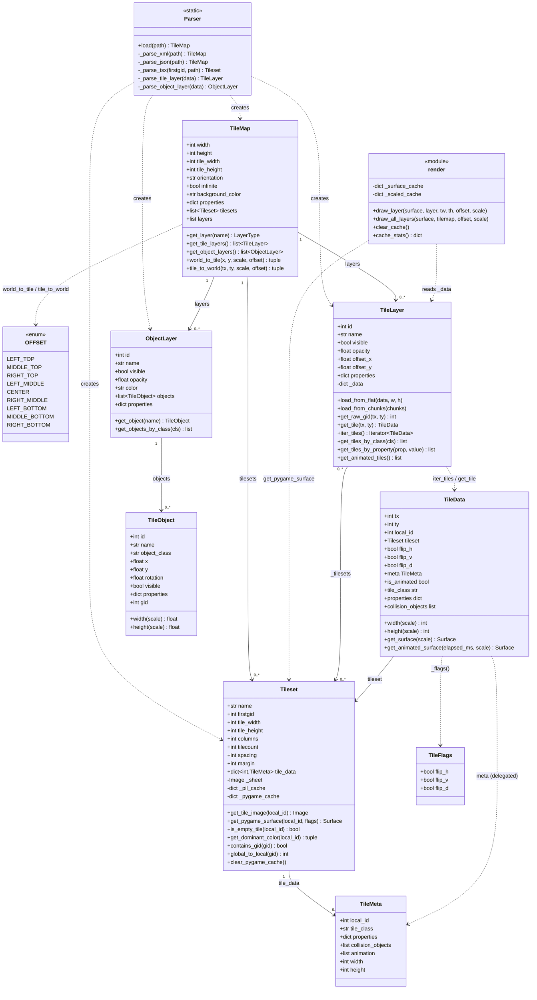
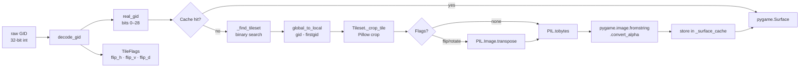
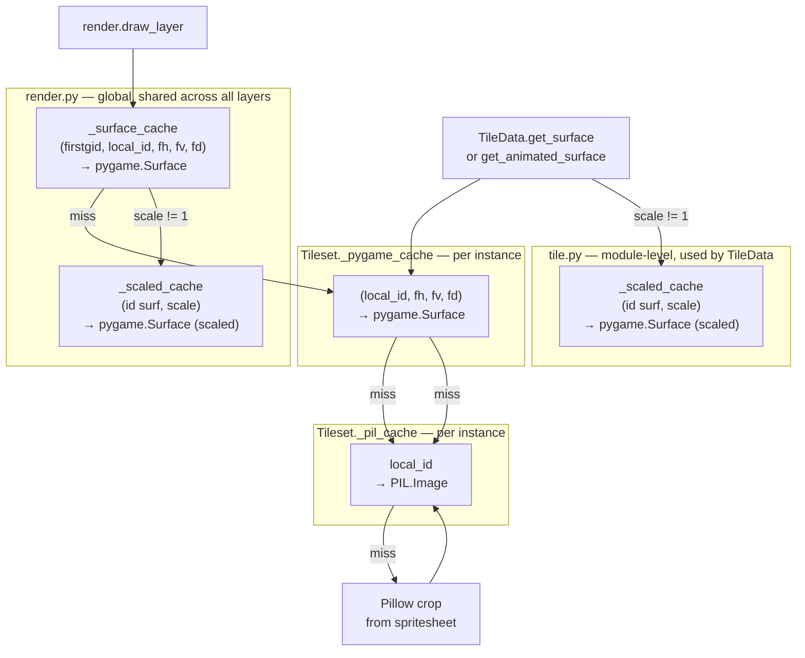

# Architecture

## Package overview

```
tiledpy/
├── __init__.py               Public API — re-exports everything below
├── map/
│   ├── map.py                TileMap (pure data model) + OFFSET enum
│   ├── parser.py             Parser — file → TileMap (XML and JSON)
│   └── render.py             Pygame rendering + global surface caches
└── layer/
    ├── tileset.py            Tileset, TileMeta, TileFlags, decode_gid
    ├── tile.py               TileData (positioned tile), TileLayer
    └── object.py             TileObject, ObjectLayer
```

Each module has a single responsibility:

| Module | Responsibility |
|--------|---------------|
| `map/parser.py` | Parse `.tmx` / `.tmj` files into data structures |
| `map/map.py` | Data model: dimensions, layers, tilesets, coordinate helpers |
| `map/render.py` | Pygame rendering with viewport culling and surface caches |
| `layer/tileset.py` | Spritesheet cropping (Pillow) + pygame surface cache |
| `layer/tile.py` | Positioned tile with `get_surface()` / `get_animated_surface()` |
| `layer/object.py` | Tiled objects (spawn points, triggers, hitboxes) |

---

## Class diagram



---

## GID decoding



---

## Cache architecture

Four cache levels from slowest (miss) to fastest (hit):



| Cache | Cleared by |
|-------|-----------|
| `render._surface_cache` | `render.clear_cache()` |
| `render._scaled_cache` | `render.clear_cache()` |
| `tile._scaled_cache` | `clear_tile_cache()` |
| `Tileset._pil_cache` | persists for life of the Tileset |
| `Tileset._pygame_cache` | `tileset.clear_pygame_cache()` |
