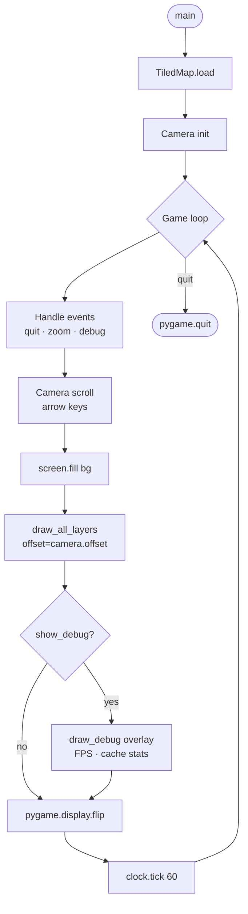

# Complete Pygame example

This guide walks through a fully working game loop that loads a TMX map,
scrolls the camera with the arrow keys, and renders every layer in order.

---

## Prerequisites

```bash
pip install tiledpy pygame pillow
```

Your project directory should look like:

```
game/
├── main.py
├── map.tmx
├── tileset.tsx          (optional external tileset)
└── sprites/
    └── tileset.png
```

---

## Full example

```python
"""
main.py — Complete tiledpy + pygame example.

Controls:
    Arrow keys  Move camera
    +/-         Zoom in/out (integer scale)
    D           Toggle debug overlay
    ESC / Q     Quit
"""

import sys
import pygame
from tiledpy import TiledMap
from tiledpy.renderer import cache_stats, clear_surface_cache


# ---------------------------------------------------------------------------
# Camera
# ---------------------------------------------------------------------------

class Camera:
    """Tracks a pixel offset with clamped scrolling."""

    def __init__(self, map_pixel_w: int, map_pixel_h: int,
                 screen_w: int, screen_h: int) -> None:
        self.x = 0
        self.y = 0
        self.map_w = map_pixel_w
        self.map_h = map_pixel_h
        self.screen_w = screen_w
        self.screen_h = screen_h

    def move(self, dx: int, dy: int) -> None:
        self.x = max(0, min(self.x + dx, self.map_w - self.screen_w))
        self.y = max(0, min(self.y + dy, self.map_h - self.screen_h))

    @property
    def offset(self) -> tuple[int, int]:
        return self.x, self.y


# ---------------------------------------------------------------------------
# Debug overlay
# ---------------------------------------------------------------------------

def draw_debug(screen: pygame.Surface, tmap: TiledMap,
               camera: Camera, clock: pygame.time.Clock,
               scale: int, font: pygame.font.Font) -> None:
    stats = cache_stats()
    lines = [
        f"FPS: {clock.get_fps():.0f}",
        f"Camera: ({camera.x}, {camera.y})",
        f"Scale: {scale}x",
        f"Map: {tmap.width}x{tmap.height} tiles",
        f"Tile size: {tmap.tile_width}x{tmap.tile_height}px",
        f"Layers: {len(tmap.layers)}",
        f"Tilesets: {len(tmap.tilesets)}",
        f"Surface cache: {stats['tile_surfaces']} entries",
        f"Scaled cache:  {stats['scaled_surfaces']} entries",
    ]
    for i, line in enumerate(lines):
        shadow = font.render(line, True, (0, 0, 0))
        text   = font.render(line, True, (255, 255, 200))
        screen.blit(shadow, (11, 11 + i * 18))
        screen.blit(text,   (10, 10 + i * 18))


# ---------------------------------------------------------------------------
# Main
# ---------------------------------------------------------------------------

def main(tmx_path: str = "map.tmx") -> None:
    pygame.init()
    pygame.display.set_caption("tiledpy demo")

    SCREEN_W, SCREEN_H = 800, 600
    SCROLL_SPEED = 4        # pixels per frame (before scale)
    INITIAL_SCALE = 2

    screen = pygame.display.set_mode((SCREEN_W, SCREEN_H))
    clock  = pygame.time.Clock()
    font   = pygame.font.SysFont("monospace", 14)

    # ---- Load map ----------------------------------------------------------
    tmap  = TiledMap(tmx_path)
    scale = INITIAL_SCALE

    map_pixel_w = tmap.width  * tmap.tile_width  * scale
    map_pixel_h = tmap.height * tmap.tile_height * scale
    camera = Camera(map_pixel_w, map_pixel_h, SCREEN_W, SCREEN_H)

    # ---- Resolve background color ------------------------------------------
    if tmap.background_color:
        hex_color = tmap.background_color.lstrip("#")
        bg_color  = tuple(int(hex_color[i:i+2], 16) for i in (0, 2, 4))
    else:
        bg_color = (30, 30, 30)

    # ---- Print layer info --------------------------------------------------
    for layer in tmap.layers:
        print(f"  layer: {layer.name!r}  visible={layer.visible}")

    show_debug = False

    # ---- Game loop ---------------------------------------------------------
    running = True
    while running:

        # -- Events ----------------------------------------------------------
        for event in pygame.event.get():
            if event.type == pygame.QUIT:
                running = False
            if event.type == pygame.KEYDOWN:
                if event.key in (pygame.K_ESCAPE, pygame.K_q):
                    running = False
                elif event.key == pygame.K_d:
                    show_debug = not show_debug
                elif event.key == pygame.K_EQUALS:
                    new_scale = min(scale + 1, 6)
                    if new_scale != scale:
                        scale = new_scale
                        clear_surface_cache()
                        map_pixel_w = tmap.width  * tmap.tile_width  * scale
                        map_pixel_h = tmap.height * tmap.tile_height * scale
                        camera = Camera(map_pixel_w, map_pixel_h,
                                        SCREEN_W, SCREEN_H)
                elif event.key == pygame.K_MINUS:
                    new_scale = max(scale - 1, 1)
                    if new_scale != scale:
                        scale = new_scale
                        clear_surface_cache()
                        map_pixel_w = tmap.width  * tmap.tile_width  * scale
                        map_pixel_h = tmap.height * tmap.tile_height * scale
                        camera = Camera(map_pixel_w, map_pixel_h,
                                        SCREEN_W, SCREEN_H)

        # -- Camera scroll ---------------------------------------------------
        keys = pygame.key.get_pressed()
        dx = dy = 0
        if keys[pygame.K_LEFT]  or keys[pygame.K_a]: dx -= SCROLL_SPEED * scale
        if keys[pygame.K_RIGHT] or keys[pygame.K_d]: dx += SCROLL_SPEED * scale
        if keys[pygame.K_UP]    or keys[pygame.K_w]: dy -= SCROLL_SPEED * scale
        if keys[pygame.K_DOWN]  or keys[pygame.K_s]: dy += SCROLL_SPEED * scale
        camera.move(dx, dy)

        # -- Draw ------------------------------------------------------------
        screen.fill(bg_color)

        # Draw every visible tile layer in order
        tmap.draw_all_layers(screen, offset=camera.offset, scale=scale)

        if show_debug:
            draw_debug(screen, tmap, camera, clock, scale, font)

        pygame.display.flip()
        clock.tick(60)

    pygame.quit()
    sys.exit(0)


if __name__ == "__main__":
    path = sys.argv[1] if len(sys.argv) > 1 else "map.tmx"
    main(path)
```

---

## Running it

```bash
python main.py map.tmx
```

Or pass any TMX path:

```bash
python main.py "../TileMap/Map.tmx"
```

---

## Controls reference

| Key | Action |
|-----|--------|
| Arrow keys / WASD | Scroll camera |
| `+` / `-` | Zoom in / out (integer scale 1–6) |
| `D` | Toggle debug overlay |
| `ESC` / `Q` | Quit |

---

## Drawing individual layers

You can control which layers to draw and in what order:

```python
# Draw only the ground layer below the player
tmap.draw_layer(screen, "ground", offset=camera.offset, scale=scale)

# --- draw player sprite here ---
screen.blit(player_surf, player_screen_pos)

# Draw the "above" layer on top of the player
tmap.draw_layer(screen, "above", offset=camera.offset, scale=scale)
```

---

## Reading object layers

```python
entities_layer = tmap.get_layer("entities")

# Place the player at the spawn point
spawn = entities_layer.get_object("player_spawn")
if spawn:
    player_world_x = spawn.x
    player_world_y = spawn.y

# Iterate all enemies
for obj in entities_layer.get_objects_by_type("enemy"):
    enemy_list.append(Enemy(obj.x, obj.y, obj.properties))
```

---

## Collision detection using tile properties

```python
from tiledpy.tileset import decode_gid

collision_layer = tmap.get_layer("collision")

def tile_is_solid(tx: int, ty: int) -> bool:
    raw = collision_layer.get_raw_gid(tx, ty)
    if raw == 0:
        return False
    real_gid, _ = decode_gid(raw)
    ts = tmap.get_tileset_for_gid(real_gid)
    if ts is None:
        return False
    local_id = ts.global_to_local(real_gid)
    td = ts.tile_data.get(local_id)
    if td is None:
        return False
    return bool(td.properties.get("collision", False))


def world_to_tile(px: float, py: float) -> tuple[int, int]:
    return int(px // tmap.tile_width), int(py // tmap.tile_height)


# Example: check if player's feet are on a solid tile
foot_x, foot_y = player_rect.midbottom
tx, ty = world_to_tile(foot_x, foot_y)
if tile_is_solid(tx, ty):
    player.on_ground = True
```

---

## Inspect sprite data with Pillow

```python
# Identify completely empty tiles in a layer
from tiledpy.tileset import decode_gid

layer = tmap.get_layer("decorations")
empty_count = 0

for tx, ty, raw in layer.iter_tiles():
    real_gid, _ = decode_gid(raw)
    ts = tmap.get_tileset_for_gid(real_gid)
    if ts and ts.is_empty_tile(ts.global_to_local(real_gid)):
        empty_count += 1

print(f"Empty tiles in layer: {empty_count}")

# Get dominant color of every unique tile
seen = set()
for tx, ty, raw in layer.iter_tiles():
    real_gid, _ = decode_gid(raw)
    if real_gid in seen:
        continue
    seen.add(real_gid)
    ts = tmap.get_tileset_for_gid(real_gid)
    if ts:
        lid = ts.global_to_local(real_gid)
        r, g, b = ts.get_dominant_color(lid)
        print(f"GID {real_gid:4d} → rgb({r},{g},{b})")
```

---

## Architecture of the example


