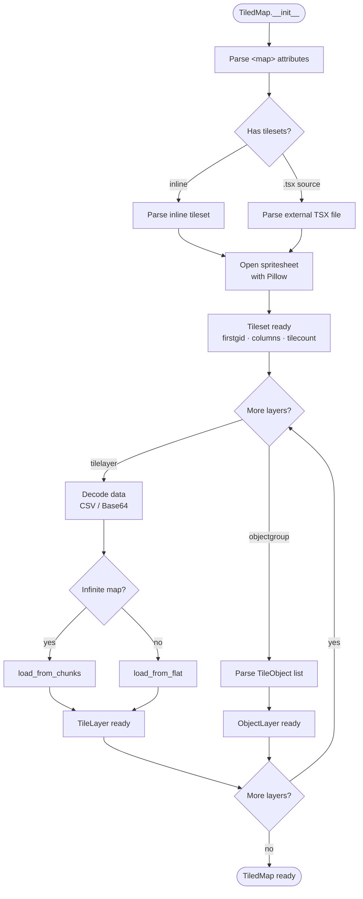

# tiledpy

A Python library for loading Tiled `.tmx` maps, using **Pillow** for sprite
detection and **Pygame** for hardware-accelerated rendering with cached surfaces.

---

## Features

- Parse `.tmx` files (finite and infinite/chunked maps)
- Load external `.tsx` tilesets or inline definitions
- Encodings: CSV, Base64 + zlib / gzip / zstd
- Tile flip and rotation flags (`GID_FLIP_H/V/D`)
- Per-tile properties, collision objects, and animations
- Pillow-based sprite helpers: empty detection, dominant color
- Pygame `draw_layer()` with two-level surface cache (tile + scaled)
- Viewport culling — only draws tiles inside the screen

---

## Quick install

```bash
pip install -e ".[docs]"   # with docs extras
pip install -e .           # runtime only
```

---

## Minimal usage

```python
import pygame
from tiledpy import TiledMap

pygame.init()
screen = pygame.display.set_mode((800, 600))
clock  = pygame.time.Clock()

tmap = TiledMap("map.tmx")
cam_x, cam_y = 0, 0

running = True
while running:
    for event in pygame.event.get():
        if event.type == pygame.QUIT:
            running = False

    screen.fill((0, 0, 0))
    tmap.draw_all_layers(screen, offset=(cam_x, cam_y))
    pygame.display.flip()
    clock.tick(60)
```

---

## High-level loading flow



---

## Package structure

```
tiledpy/
├── __init__.py      Public API exports
├── loader.py        TiledMap — parser + draw_layer()
├── tileset.py       Tileset — Pillow crop + pygame surface cache
├── layer.py         TileLayer · ObjectLayer · TileObject
└── renderer.py      draw_layer() with two-level global cache
```
