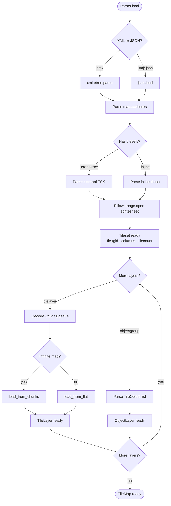

# tiledpy

A Python library for loading [Tiled](https://www.mapeditor.org/) maps,
using **Pillow** for sprite extraction and **Pygame** for hardware-accelerated
rendering with multi-level surface caching.

---

## Features

- Parse `.tmx` (XML) and `.tmj` / `.json` (JSON) map files
- Finite maps and infinite/chunked maps
- Encodings: CSV, Base64 + zlib / gzip / zstd
- External `.tsx` tilesets and inline definitions
- Tile flip and rotation flags (`flip_h`, `flip_v`, `flip_d`)
- Per-tile class, properties, collision objects, and animations
- `TileData.get_surface(scale)` — static tile surface with scale cache
- `TileData.get_animated_surface(elapsed_ms, scale)` — animated tile playback
- `render.draw_all_layers()` with viewport culling and two-level global cache
- Pillow helpers: `is_empty_tile()`, `get_dominant_color()`

---

## Quick install

```bash
pip install -e ".[docs]"   # with MkDocs extras
pip install -e .           # runtime only
```

---

## Minimal usage

```python
import pygame
from tiledpy import Parser
import tiledpy.map.render as render

pygame.init()
screen = pygame.display.set_mode((800, 600))
clock  = pygame.time.Clock()

tmap   = Parser.load("map.tmx")    # .tmx (XML) or .tmj / .json (JSON)
cam_x, cam_y = 0, 0

running = True
while running:
    for event in pygame.event.get():
        if event.type == pygame.QUIT:
            running = False

    screen.fill((0, 0, 0))
    render.draw_all_layers(screen, tmap, offset=(cam_x, cam_y), scale=2)
    pygame.display.flip()
    clock.tick(60)
```

---

## Loading flow


```mermaid
flowchart TD
    A([Parser.load]) --> B{XML or JSON?}
    B -- .tmx --> C[xml.etree.parse]
    B -- .tmj/.json --> D[json.load]
    C --> E[Parse map attributes]
    D --> E
    E --> F{Has tilesets?}
    F -- .tsx source --> G[Parse external TSX]
    F -- inline --> H[Parse inline tileset]
    G --> I[Pillow Image.open spritesheet]
    H --> I
    I --> J[Tileset ready\nfirstgid · columns · tilecount]
    J --> K{More layers?}
    K -- tilelayer --> L[Decode CSV / Base64]
    L --> M{Infinite map?}
    M -- yes --> N[load_from_chunks]
    M -- no --> O[load_from_flat]
    N --> P[TileLayer ready]
    O --> P
    K -- objectgroup --> Q[Parse TileObject list]
    Q --> R[ObjectLayer ready]
    P --> S{More layers?}
    R --> S
    S -- yes --> K
    S -- no --> T([TileMap ready])
```

---

## Package structure

```
tiledpy/
├── __init__.py               Public API exports
├── map/
│   ├── map.py                TileMap (data model) + OFFSET enum
│   ├── parser.py             Parser.load(path) → TileMap
│   └── render.py             draw_layer / draw_all_layers / clear_cache
└── layer/
    ├── tileset.py            Tileset, TileMeta, TileFlags, decode_gid
    ├── tile.py               TileData (positioned tile), TileLayer
    └── object.py             TileObject, ObjectLayer
```
