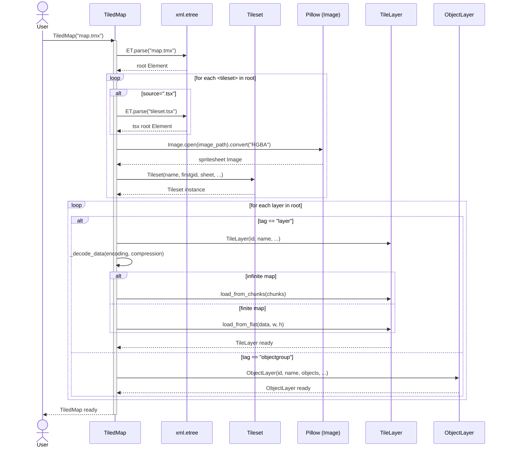
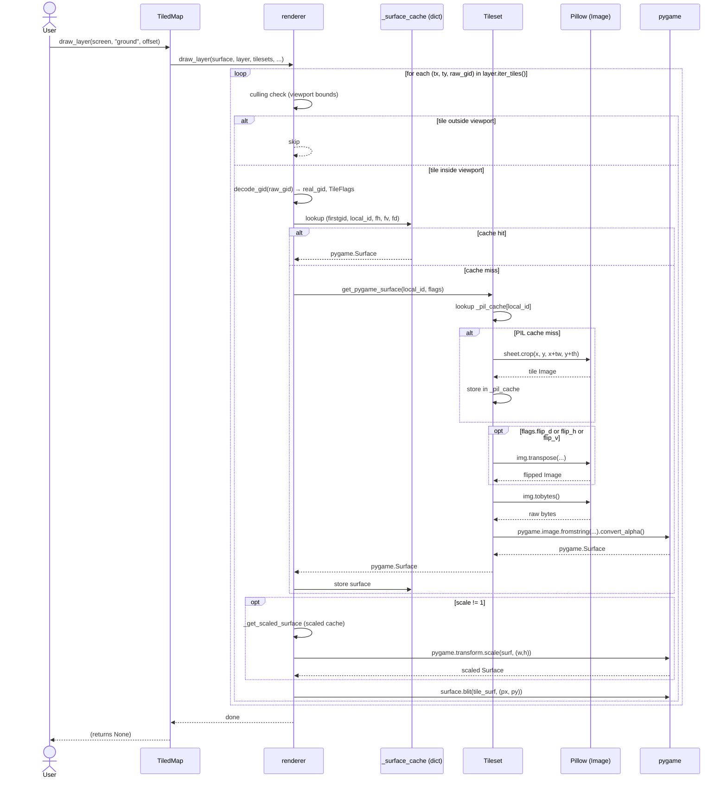
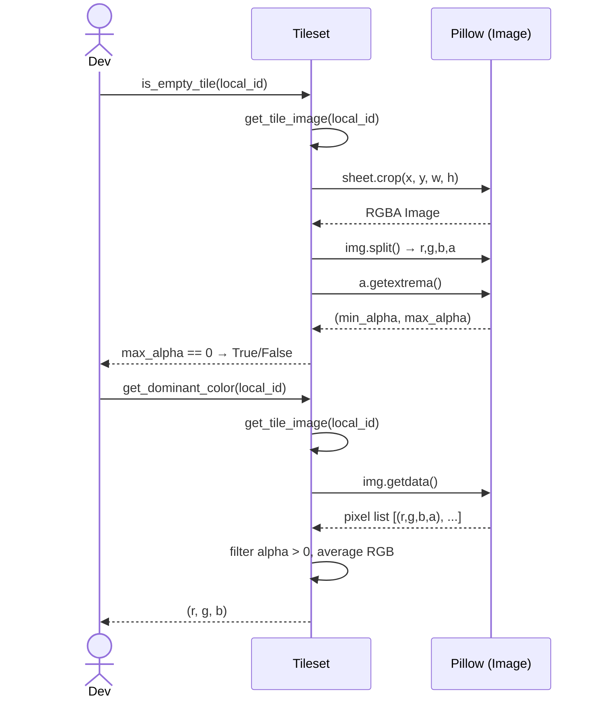
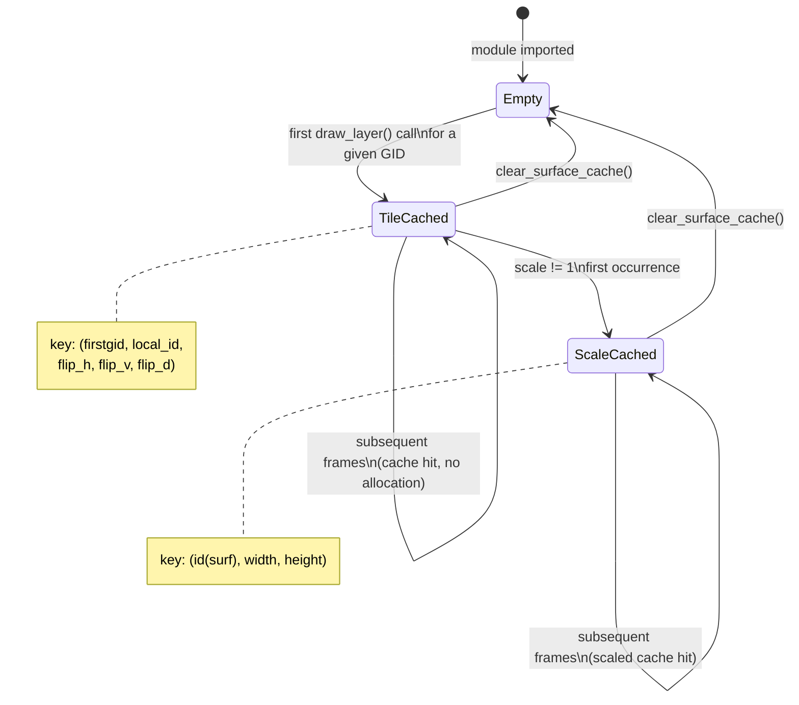

# Interaction diagrams

## Loading a TMX map

Sequence from `TiledMap("map.tmx")` to the moment it's ready to render.

---

## draw_layer() — one frame

Full call chain from `tmap.draw_layer(screen, "ground")` down to `surface.blit`.

---

## Tileset sprite detection (Pillow helpers)

---

## Cache lifecycle

