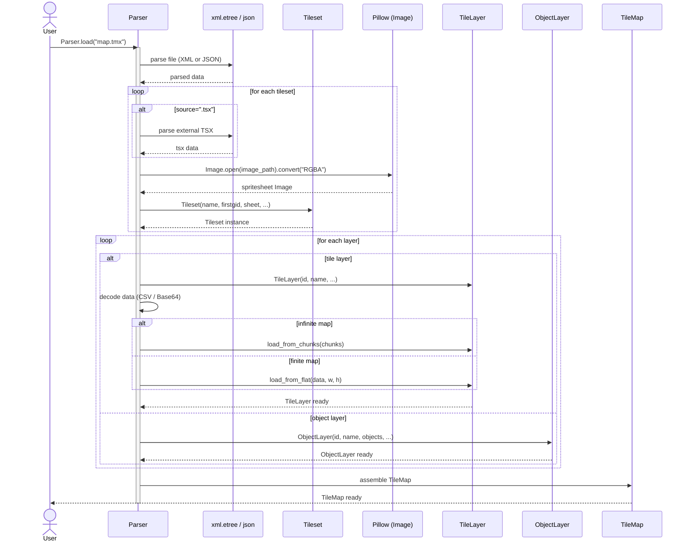
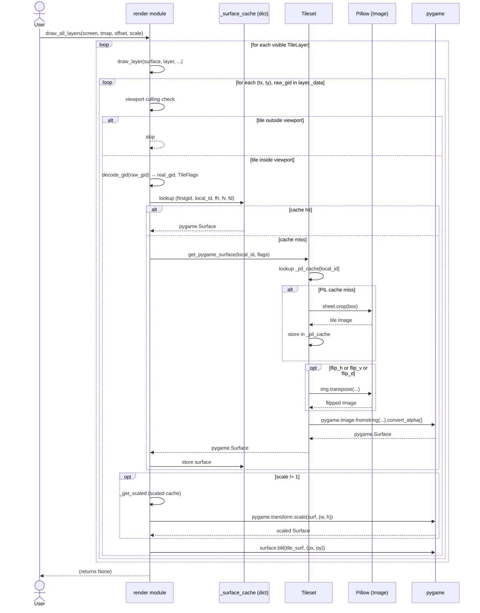
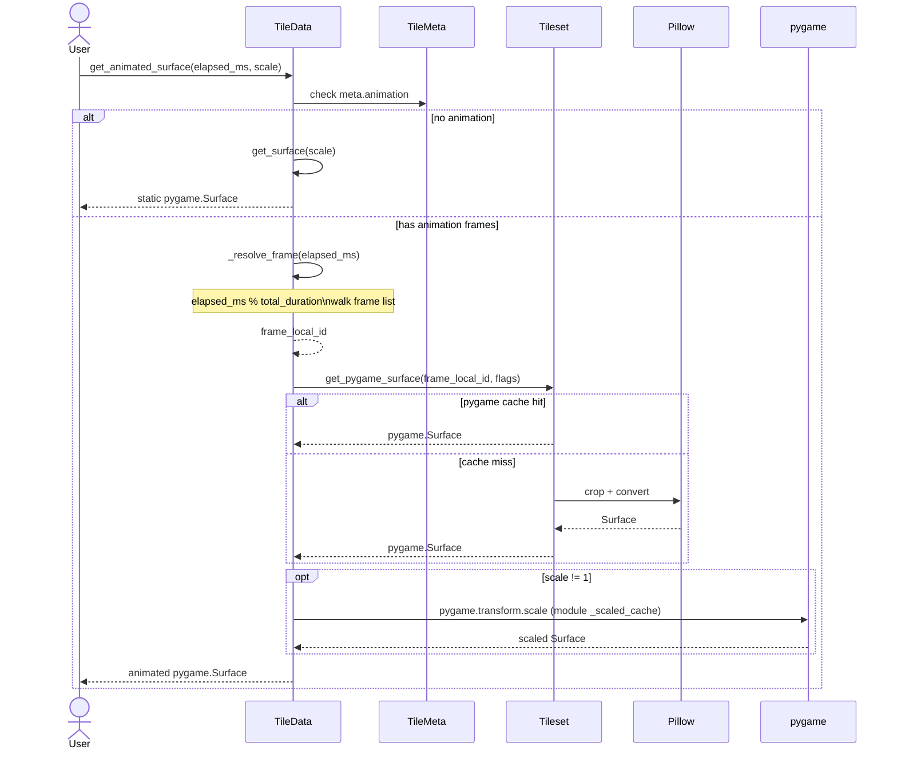
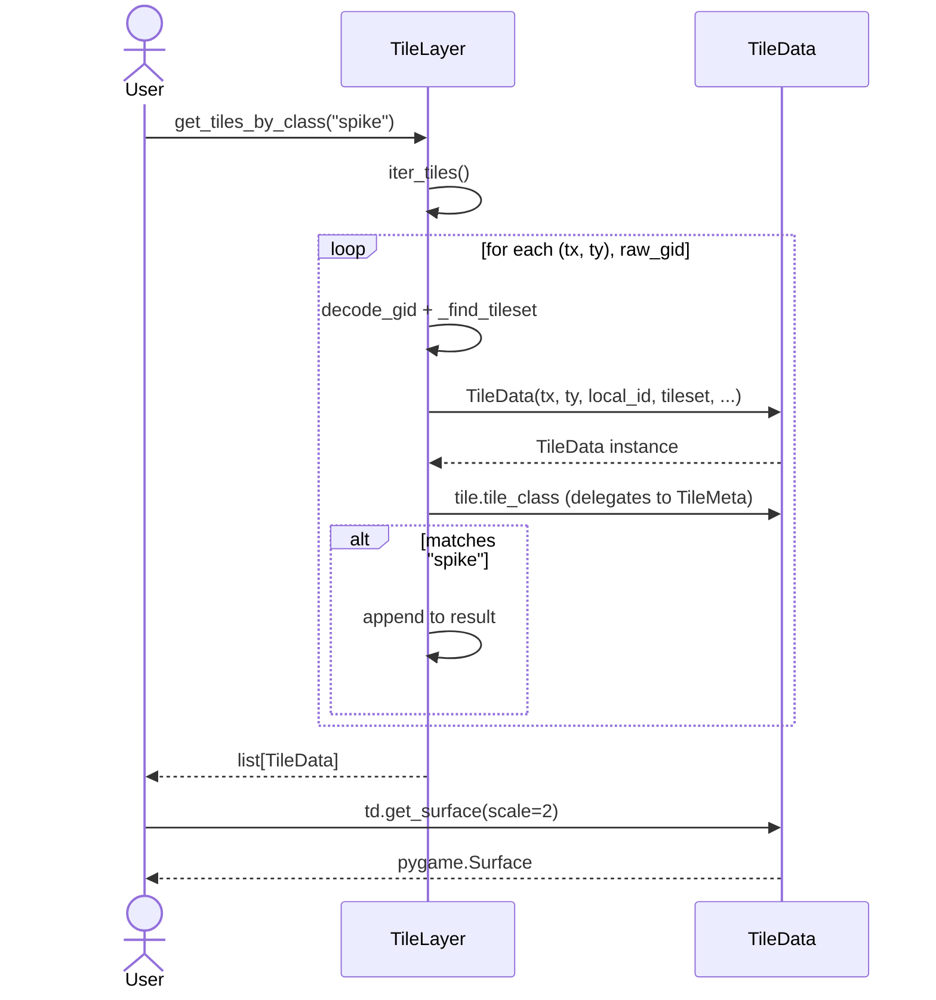
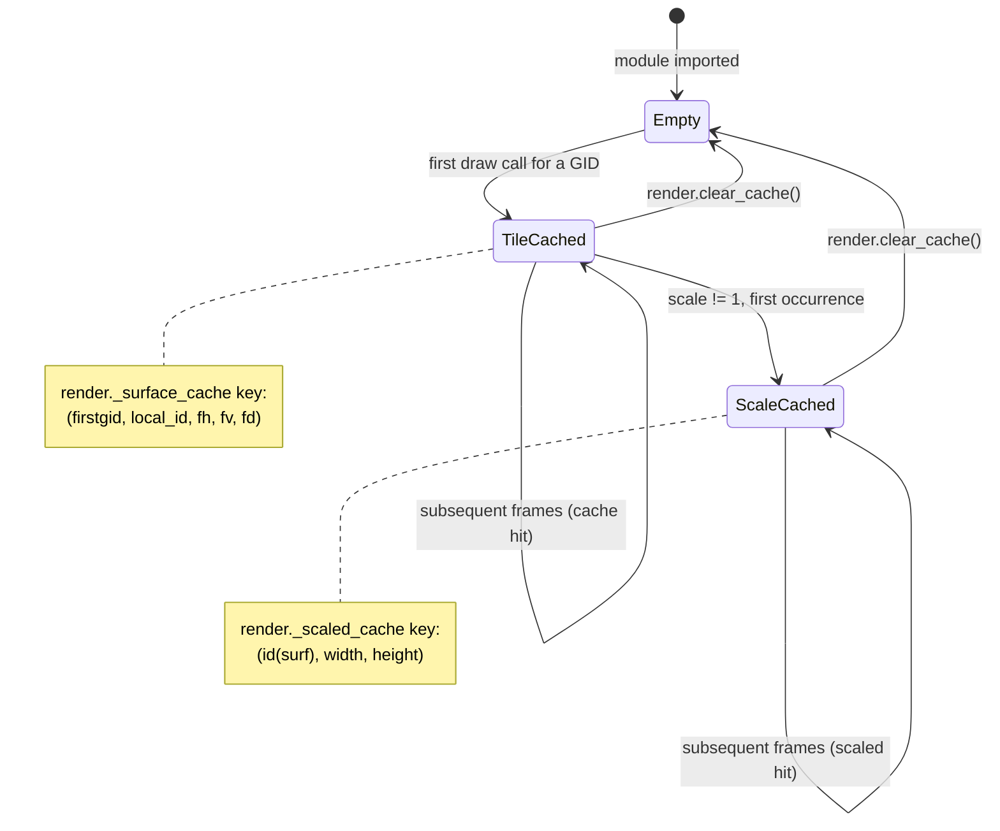

# Interaction diagrams

## Loading a map

Sequence from `Parser.load("map.tmx")` to a ready `TileMap`.

```mermaid
sequenceDiagram
    actor User
    participant P  as Parser
    participant ET as xml.etree / json
    participant TS as Tileset
    participant PIL as Pillow (Image)
    participant TL as TileLayer
    participant OL as ObjectLayer
    participant TM as TileMap

    User->>P: Parser.load("map.tmx")
    activate P
    P->>ET: parse file (XML or JSON)
    ET-->>P: parsed data

    loop for each tileset
        alt source=".tsx"
            P->>ET: parse external TSX
            ET-->>P: tsx data
        end
        P->>PIL: Image.open(image_path).convert("RGBA")
        PIL-->>P: spritesheet Image
        P->>TS: Tileset(name, firstgid, sheet, ...)
        TS-->>P: Tileset instance
    end

    loop for each layer
        alt tile layer
            P->>TL: TileLayer(id, name, ...)
            P->>P: decode data (CSV / Base64)
            alt infinite map
                P->>TL: load_from_chunks(chunks)
            else finite map
                P->>TL: load_from_flat(data, w, h)
            end
            TL-->>P: TileLayer ready
        else object layer
            P->>OL: ObjectLayer(id, name, objects, ...)
            OL-->>P: ObjectLayer ready
        end
    end

    P->>TM: assemble TileMap
    TM-->>User: TileMap ready
    deactivate P
```

---

## render.draw_all_layers() — one frame

Full call chain from `render.draw_all_layers(screen, tmap, ...)` to `surface.blit`.

```mermaid
sequenceDiagram
    actor User
    participant R  as render module
    participant SC as _surface_cache (dict)
    participant TS as Tileset
    participant PIL as Pillow (Image)
    participant PG as pygame

    User->>R: draw_all_layers(screen, tmap, offset, scale)

    loop for each visible TileLayer
        R->>R: draw_layer(surface, layer, ...)

        loop for each (tx, ty), raw_gid in layer._data
            R->>R: viewport culling check
            alt tile outside viewport
                R-->>R: skip
            else tile inside viewport
                R->>R: decode_gid(raw_gid) → real_gid, TileFlags
                R->>SC: lookup (firstgid, local_id, fh, fv, fd)
                alt cache hit
                    SC-->>R: pygame.Surface
                else cache miss
                    R->>TS: get_pygame_surface(local_id, flags)
                    TS->>TS: lookup _pil_cache[local_id]
                    alt PIL cache miss
                        TS->>PIL: sheet.crop(box)
                        PIL-->>TS: tile Image
                        TS->>TS: store in _pil_cache
                    end
                    opt flip_h or flip_v or flip_d
                        TS->>PIL: img.transpose(...)
                        PIL-->>TS: flipped Image
                    end
                    TS->>PG: pygame.image.fromstring(...).convert_alpha()
                    PG-->>TS: pygame.Surface
                    TS-->>R: pygame.Surface
                    R->>SC: store surface
                end
                opt scale != 1
                    R->>R: _get_scaled (scaled cache)
                    R->>PG: pygame.transform.scale(surf, (w, h))
                    PG-->>R: scaled Surface
                end
                R->>PG: surface.blit(tile_surf, (px, py))
            end
        end
    end

    R-->>User: (returns None)
```

---

## TileData.get_animated_surface() — animated tile

Per-tile call used when rendering animated tiles directly (e.g. in a custom loop).

```mermaid
sequenceDiagram
    actor User
    participant TD as TileData
    participant TM as TileMeta
    participant TS as Tileset
    participant PIL as Pillow
    participant PG as pygame

    User->>TD: get_animated_surface(elapsed_ms, scale)
    TD->>TM: check meta.animation
    alt no animation
        TD->>TD: get_surface(scale)
        TD-->>User: static pygame.Surface
    else has animation frames
        TD->>TD: _resolve_frame(elapsed_ms)
        note over TD: elapsed_ms % total_duration\nwalk frame list
        TD-->>TD: frame_local_id
        TD->>TS: get_pygame_surface(frame_local_id, flags)
        alt pygame cache hit
            TS-->>TD: pygame.Surface
        else cache miss
            TS->>PIL: crop + convert
            PIL-->>TS: Surface
            TS-->>TD: pygame.Surface
        end
        opt scale != 1
            TD->>PG: pygame.transform.scale (module _scaled_cache)
            PG-->>TD: scaled Surface
        end
        TD-->>User: animated pygame.Surface
    end
```

---

## TileLayer query flow

Querying tiles by class or property and using the resulting `TileData`.

```mermaid
sequenceDiagram
    actor User
    participant TL as TileLayer
    participant TD as TileData

    User->>TL: get_tiles_by_class("spike")
    TL->>TL: iter_tiles()
    loop for each (tx, ty), raw_gid
        TL->>TL: decode_gid + _find_tileset
        TL->>TD: TileData(tx, ty, local_id, tileset, ...)
        TD-->>TL: TileData instance
        TL->>TD: tile.tile_class (delegates to TileMeta)
        alt matches "spike"
            TL->>TL: append to result
        end
    end
    TL-->>User: list[TileData]

    User->>TD: td.get_surface(scale=2)
    TD-->>User: pygame.Surface
```

---

## Cache lifecycle

```mermaid
stateDiagram-v2
    [*] --> Empty : module imported

    Empty --> TileCached : first draw call for a GID
    TileCached --> TileCached : subsequent frames (cache hit)

    TileCached --> ScaleCached : scale != 1, first occurrence
    ScaleCached --> ScaleCached : subsequent frames (scaled hit)

    TileCached --> Empty : render.clear_cache()
    ScaleCached --> Empty : render.clear_cache()

    note right of TileCached
        render._surface_cache key:
        (firstgid, local_id, fh, fv, fd)
    end note

    note right of ScaleCached
        render._scaled_cache key:
        (id(surf), width, height)
    end note
```
